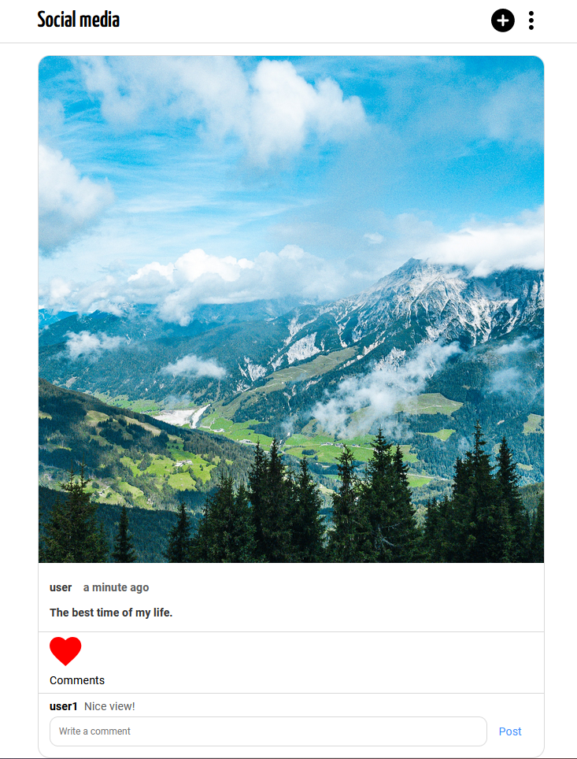
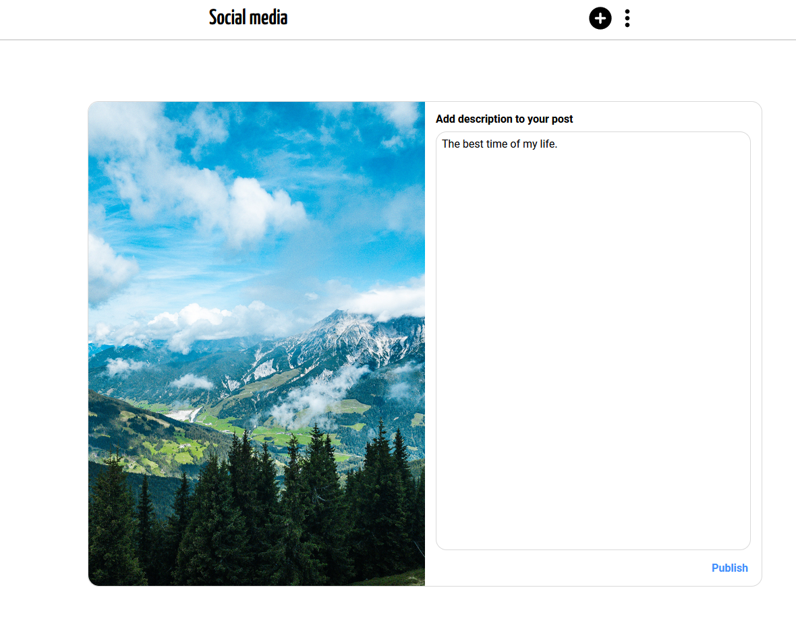
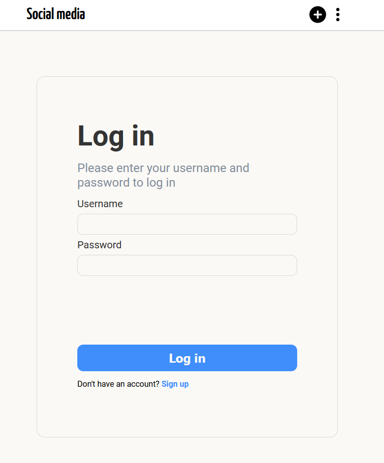
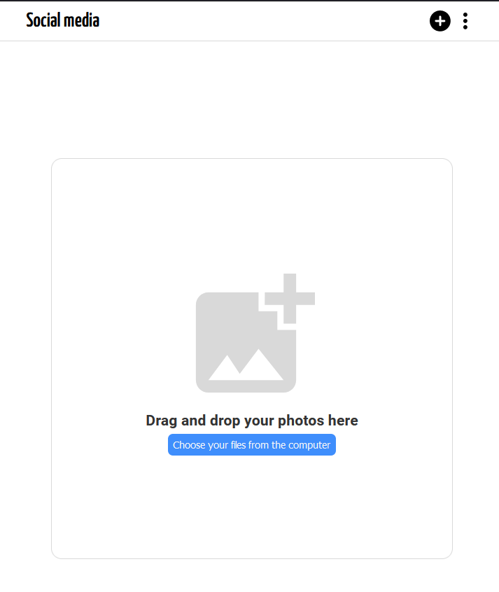

# Instagram clone
An application built with React, Redux Toolkit and Django.

## The app allows users to:
- upload and delete a post,
- comment a post,
- like a post,
- login, logout and delete an account

# Technologies used
- React
- Redux Toolkit
- CSS and Styled Components
- Django

## Installation and Setup Instructions
### React
Clone down this repository. You will need `node` and `npm` installed globally on your machine.

Installation:

`npm install`

Starting server:

`npm start`

### Django
Migrating the models

`python manage.py migrate`

Running the server

`python manage.py runserver`
